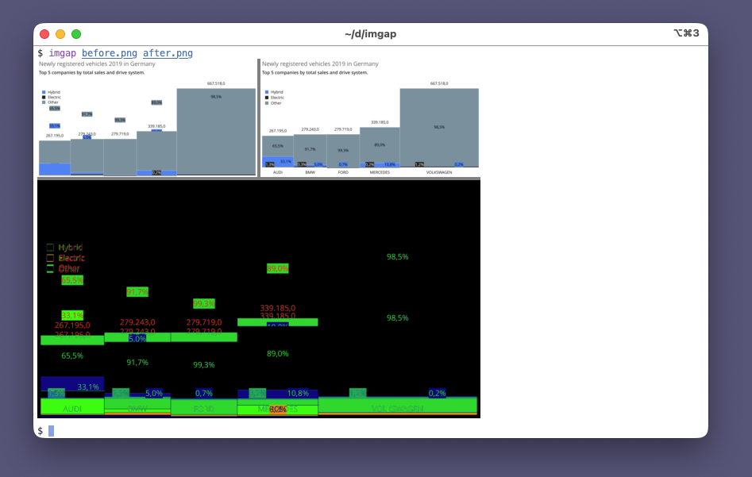

# imgap

[](https://github.com/roblillack/imgap/actions)
[](https://crates.io/crates/imgap)
[](https://crates.io/crates/imgap)

A command-line tool to visualize differences between two images, rendered directly in your terminal.



The diff heatmap shows pixel differences using a color scale: black (identical) through blue, green, yellow to red (maximum difference). Magenta indicates regions where images differ in size.

## Usage

```
imgap <image1> <image2>
```

Supports PNG, JPG, WebP, GIF, BMP, TIFF, and other common formats.

### Interactive mode

Pass `-i` for a full-screen TUI that overlays the two images with a keyboard-driven slider:

```
imgap -i <image1> <image2>
```

- `←` / `→` — move the slider (hold `Shift` for bigger steps)
- `m` — cycle comparison modes: **2-up**, **swipe**, **onion skin**
- `s` — swap to the left-only view; press again for right-only; `m` returns to the last comparison mode
- `Home` / `End` — jump to 0% / 100%
- `q` / `Esc` — quit

## Using with git difftool

Once `diff.image.command` is configured (see [Using with git diff](#using-with-git-diff) below), `git difftool` works out of the box. imgap automatically enters interactive mode when git invokes it through difftool (it checks for `GIT_DIFFTOOL_TRUST_EXIT_CODE` in the environment), so plain `git diff` stays inline and static while `git difftool` pops the interactive TUI:

```sh
git difftool -- '**/*.png'
```

difftool opens each modified image in the interactive TUI one after another — press `q` to advance to the next file.

## Install

```
cargo install imgap
```

## Terminal support

imgap auto-detects your terminal's image protocol:

- **Kitty** graphics protocol
- **iTerm2** inline images (also WezTerm)
- **Sixel** (foot, xterm, mlterm, Windows Terminal, and others)

## Using with git diff

imgap also natively understands git's external diff calling convention (for the inline, non-interactive view) -- no wrapper script needed.

### 1. Configure git

```sh
git config --global diff.image.command imgap
```

### 2. Set up .gitattributes

In your repository (or globally in `~/.config/git/attributes`):

```
*.png diff=image
*.jpg diff=image
*.jpeg diff=image
*.webp diff=image
*.bmp diff=image
*.gif diff=image
```

### 3. Use an image-aware pager

Git pipes diff output through a pager (typically `less`), which does not understand image escape sequences. To see inline images in `git diff`, use an image-aware pager like [lessi](https://github.com/roblillack/lessi):

```sh
git config --global pager.diff lessi
```

Now `git diff` will show visual image comparisons inline in your terminal.

## Building from source

```
cargo build --release
```

The binary will be at `target/release/imgap`. No non-Rust dependencies required.
